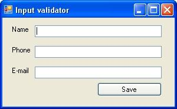

## Regex

### Exercise 1: Input validation

### Task

Using Visual Studio, create a new windows application project, and create a basic form, which prompts the user his/her name, e-mail address and phone number.



After clicking the save button, evaluate the input if the phone number and e-mail address are valid.

Since this is not a WinForms-oriented course you can perform this validation simply in the event handler of the save button. 

### Hint

For the corresponding Regex expressions use the examples in the presentation.

Step by step

{1} Name the controls properly, for example
* txtName
* txtPhone
* txtEmail
* btnSave

{2} Add reference to the namespace for using the regular expressions

```C#
using System.Windows.Forms;
using System.Text.RegularExpressions;
```

{3} Double click the button to create the event handler automatically. Type the following code for the evaluation.

```C#
private void btnSave_Click(object sender, EventArgs e)
{
 if (!Regex.IsMatch(txtName.Text, @"^([A-Za-z]*\s*)*$"))
   MessageBox.Show("The name is invalid (only alphabetical characters are allowed)");

 if (!Regex.IsMatch(txtPhone.Text, @"^((\(\d{3}\)?)|(\d{3}-))?\d{3}-\d{4}$"))
   MessageBox.Show("The phone number is not a valid US phone number");

 if (!Regex.IsMatch(txtEmail.Text, @"^([a-zA-Z0-9_\-” [email protected]\.]+)@((\[[0-9]{1,3}" + @"\.[0-9]{1,3}\.[0-9]{1,3}\.)|(([a-zA-Z0-9\-]+\" + @".)+))([a-zA-Z]{2,4}|[0-9]{1,3})(\]?)$"))
   MessageBox.Show("The e-mail address is not valid.");
}
```

### Exercise 2: Reformat a String

### Task

In this exercise, you must reformat phone numbers into a standard `(###) ###-####` format.
You can implement it by extending the previous WinForms application.
As an input, you expect a string which matches the following Regex pattern:

```C#
^\(?(\d{3})\)?[\s\-]?(\d{3})\-?(\d{4})$
```

You should extract the matching groups from the input and reorganize them for the output format.

### Step by step

{1} Add a method named ReformatPhone that returns a string and accepts a single string as an argument. Reformat the data into the (###) ###-#### format.

```C#
static string ReformatPhone(string s)
{
 Match m = Regex.Match(s, @"^\(?(\d{3})\)?[\s\-]?(\d{3})\-?(\d{4})$");

 return String.Format("({0}) {1}-{2}", m.Groups[1], m.Groups[2], m.Groups[3]);
}
```

Notice that each of the `\d{n}` expressions is surrounded by parentheses. This places each of the sets of numbers into a separate group that can be easily formatted using **String.Format**.

{2} Change the **btnSave** event handler method so that it writes ReformatPhone(s) into the txtPhone field:

```C#
txtPhone.Text = ReformatPhone(txtPhone.Text)
```

Of course you should execute this line only after the validation! 

### Exercise 3: Convert a Text File to a Different Encoding Type

In this exercise, you convert a text file to UTF-7.

### Step by step

{1} Use Visual Studio 2015 to create a blank console application.

{2} Write code to read the **C:\boot.ini** file, and then write it to a file named **bootutf7.txt** using the UTF-7 encoding type.
For example, the following code (which requires the **System.IO** namespace) would work:

```C#
StreamReader sr = new StreamReader(@"C:\boot.ini");
StreamWriter sw = new StreamWriter("boot-utf7.txt", false, Encoding.UTF7);

sw.WriteLine(sr.ReadToEnd());
sw.Close();
sr.Close();
```

{3} Run your application, and open the boot-utf7.txt file in Notepad.
If the file was translated correctly, Notepad will display it with some invalid characters
because Notepad does not support the UTF-7 encoding type.

----

----

## Serialization

### Exercise 1: Make a Class Serializable

### Task

In this exercise, you modify a custom class
so that developers can easily store it to the disk for later retrieval
or transfer it across a network to another .NET Framework application.
Open the C# project containing Person class, and examine the contents!
You need to modify the Person class to make it serializable. What would you do?

### Step by step

{1} Examine the Person class. What changes do you need to make so that the Person class is serializable? You must add the Serializable attribute.

{2} Add the System.Runtime.Serialization namespace to the class.

{3} Add the Serializable attribute to the Person class, and then build the project to ensure it compiles correctly.

### Exercise 2: Serialize an Object

### Task

In this exercise, you write code to store an object to the disk using the most efficient method possible.

### Step by step

{1} Open the Serialize-People project you modified in Exercise 1.

{2} Add the System.IO, System.Runtime.Serialization and System.Runtime.Serialization.Formatters.Binary namespaces to the file containing Main.

{3} Add code to the Serialize method to serialize the sp object to a file in the current directory named Person.dat. Your code could look like the following:

```C#
private static void Serialize(Person sp)
{
 // Create file to save the data to
 FileStream fs = new FileStream("Person.Dat", FileMode.Create);

 // Create a BinaryFormatter object to perform the serialization
 BinaryFormatter bf = new BinaryFormatter();

 // Use the BinaryFormatter object to serialize the data to the file
 bf.Serialize(fs, sp);

 // Close the file
 fs.Close();
}
```

{4} Build the project, and resolve any errors.

{5} Open a command prompt to the build directory, and then test the application by running the following command:

```
Serialize-People Tony 1923 4 22
```

{6} Examine the serialized data by opening the file your application produced to verify that the name you entered was successfully captured. The date and age information are contained in the serialized data as well; however, they are less easy to interpret in Notepad.

### Exercise 3: Deserialize an Object

### Task

In this exercise, you must read an object from the disk that has been serialized by using BinaryFormatter.

### Step by step

{1} Open the Serialize-People project you modified in Exercises 1 and 2.

{2} Add code to the Deserialize method in the main program to deserialize the dsp object from a file in the default directory named Person.dat. Your code could look like the following:

```C#
private static Person Deserialize()
{
 Person dsp = new Person();

 // Open file to read the data from
 FileStream fs = new FileStream("Person.Dat", FileMode.Open);

 // Create a BinaryFormatter object to perform the deserialization
 BinaryFormatter bf = new BinaryFormatter();

 // Use the BinaryFormatter object to deserialize the data from the file
 dsp = (Person)bf.Deserialize(fs);

 // Close the file
 fs.Close();

 return dsp;
}
```

{3} Build the project, and resolve any errors.

{4} Open a command prompt to the build directory, and then run the following command with no command-line parameters:

```
Serialize-People
```

Note that the Serialize-People command displays the name, date of birth, and age of the previously serialized Person object.

### Exercise 4: Optimize a Class for Deserialization

### Task

In this exercise, you modify a class to improve the efficiency of serialization.

### Step by step

{1} Open the SerializePeople project you modified in Exercises 1, 2, and 3.

{2} Modify the Person class to prevent the age member from being serialized.
To do this, add the NonSerialized attribute to the member, as the following code demonstrates:

```C#
[NonSerialized] public int age;
```

{3} Build and run the project with no command-line parameters.
Note that the Serialize-People command displays the name and date of birth of the previously serialized Person object.
However, the age is displayed as zero.

{4} Modify the Person class to implement the IDeserializationCallback interface, as the following code snippet demonstrates:

```C#
namespace Serialize_People
{
 [Serializable]
 class Person : IdeserializationCallback

 {

 }

}
```

{5} Add the IDeserializationCallback.OnDeserialization method to the Person class. Your code could look like the following:

```C#
void IDeserializationCallback.OnDeserialization(Object sender)
{

}
```

{6} Build and run the project with no command-line parameters. Note that the Serialize-People command displays the name, date of birth, and age of the previously serialized Person object. The age displays properly this time because it is calculated immediately after deserialization.

```C#
// After deserialization, calculate the age
CalculateAge();
```

### Exercise 5: Update a Class to Use Custom Serialization

### Task

In this exercise, you will update a class to improve the efficiency of serialization while maintaining complete control over how data is stored and retrieved. You can continue from the C# project in the Lesson3-Serialize-People folder.

### Step by step

{1} Add the System.Runtime.Serialization namespace to the Person class.

{2} Add the Serializable attribute to the Person class, and then build the project to ensure it compiles correctly.

{3} Modify the Person class so that it implements ISerializable.

{4} Add the GetObjectData method, which accepts a SerializationInfo object and a StreamingContext object, and adds items to be serialized to the SerializationInfo object. Add the name and dateOfBirth variables to the SerializationInfo object, but do not add the age variable. Your code could look like the following:

```C#
public virtual void GetObjectData(SerializationInfo info,
StreamingContext context)
{

}
```

{5} Add the serialization constructor, which accepts a SerializationInfo object and a StreamingContext object, and then initializes member variables using the contents of the SerializationInfo object. Use the same element names you used in the previous step. After you have deserialized all variables, call the CalculateAge method to initialize the age variables. Your code could look like the following:

```C#
public Person(SerializationInfo info, StreamingContext context)
{
 info.AddValue("Name", name);
 info.AddValue("DOB", dateOfBirth);

 name = info.GetString("Name");
 dateOfBirth = info.GetDateTime("DOB");
 CalculateAge();
}
```

{6} Build the project, and resolve any errors.

{7} Open a command prompt to the build directory, and then run the following command:

```
Serialize-People Tony 1923 4 22
```

{8} Now run the command with no parameters to verify that deserialization works properly.
