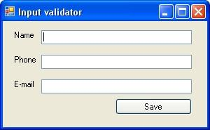

## Regex

### Exercise 1: Input validation

### Task

Using Visual Studio, create a new windows application project, and create a basic form, which prompts the user his/her name, e-mail address and phone number.



After clicking the save button, evaluate the input if the phone number and e-mail address are valid.

Since this is not a WinForms-oriented course you can perform this validation simply in the event handler of the save button. 

### Hint

For the corresponding Regex expressions use the examples in the presentation.

Step by step

{1} Name the controls properly, for example
* txtName
* txtPhone
* txtEmail
* btnSave

{2} Add reference to the namespace for using the regular expressions

```C#
using System.Windows.Forms;
using System.Text.RegularExpressions;
```

{3} Double click the button to create the event handler automatically. Type the following code for the evaluation.

```C#
private void btnSave_Click(object sender, EventArgs e)
{
 if (!Regex.IsMatch(txtName.Text, @"^([A-Za-z]*\s*)*$"))
   MessageBox.Show("The name is invalid (only alphabetical characters are allowed)");

 if (!Regex.IsMatch(txtPhone.Text, @"^((\(\d{3}\)?)|(\d{3}-))?\d{3}-\d{4}$"))
   MessageBox.Show("The phone number is not a valid US phone number");

 if (!Regex.IsMatch(txtEmail.Text, @"^([a-zA-Z0-9_\-” [email protected]\.]+)@((\[[0-9]{1,3}" + @"\.[0-9]{1,3}\.[0-9]{1,3}\.)|(([a-zA-Z0-9\-]+\" + @".)+))([a-zA-Z]{2,4}|[0-9]{1,3})(\]?)$"))
   MessageBox.Show("The e-mail address is not valid.");
}
```

### Exercise 2: Reformat a String

### Task

In this exercise, you must reformat phone numbers into a standard `(###) ###-####` format.
You can implement it by extending the previous WinForms application.
As an input, you expect a string which matches the following Regex pattern:

```C#
^\(?(\d{3})\)?[\s\-]?(\d{3})\-?(\d{4})$
```

You should extract the matching groups from the input and reorganize them for the output format.

### Step by step

{1} Add a method named ReformatPhone that returns a string and accepts a single string as an argument. Reformat the data into the (###) ###-#### format.

```C#
static string ReformatPhone(string s)
{
 Match m = Regex.Match(s, @"^\(?(\d{3})\)?[\s\-]?(\d{3})\-?(\d{4})$");

 return String.Format("({0}) {1}-{2}", m.Groups[1], m.Groups[2], m.Groups[3]);
}
```

Notice that each of the `\d{n}` expressions is surrounded by parentheses. This places each of the sets of numbers into a separate group that can be easily formatted using **String.Format**.

{2} Change the **btnSave** event handler method so that it writes ReformatPhone(s) into the txtPhone field:

```C#
txtPhone.Text = ReformatPhone(txtPhone.Text)
```

Of course you should execute this line only after the validation! 

### Exercise 3: Convert a Text File to a Different Encoding Type

In this exercise, you convert a text file to UTF-7.

### Step by step

{1} Use Visual Studio 2015 to create a blank console application.

{2} Write code to read the **C:\boot.ini** file, and then write it to a file named **bootutf7.txt** using the UTF-7 encoding type.
For example, the following code (which requires the **System.IO** namespace) would work:

```C#
StreamReader sr = new StreamReader(@"C:\boot.ini");
StreamWriter sw = new StreamWriter("boot-utf7.txt", false, Encoding.UTF7);

sw.WriteLine(sr.ReadToEnd());
sw.Close();
sr.Close();
```

{3} Run your application, and open the boot-utf7.txt file in Notepad.
If the file was translated correctly, Notepad will display it with some invalid characters
because Notepad does not support the UTF-7 encoding type.

----

----

Next: [Serialization](descSerializing.md)  
Prev: [Overwiev](descOverwiev.md)  
[Back to README](README.md)
